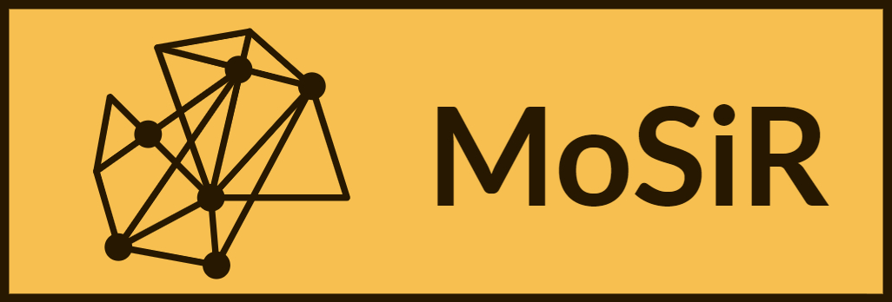

<a href = "https://github.com/Bureau-du-Forestier-en-chef/MoSiR/blob/master/README.md"></a>

<!-- HEADER -->
<h1 align="center">
  <br>
  <a href="https://github.com/Bureau-du-Forestier-en-chef/MoSiR"></a>
  <br>
  Modèle de Simulation en Réseau
  <br>
</h1>

<h4 align="center"> 
  <a href="https://forestierenchef.gouv.qc.ca"></a>
  <br>
<h4>

### Pour la documentation complète de MoSiR, veuillez consulter le [Wiki](https://github.com/Bureau-du-Forestier-en-chef/MoSiR/wiki) du Github.

<!-- TEXTE -->
# Description
<p align="justify"> 
  MoSiR (Modèle de Simulation en Réseau), est un outil puissant conçu par le Bureau du forestier en chef (BFEC) pour faciliter la modélisation et la simulation du devenir du carbone dans les produits du bois issus de l'exploitation forestière. MoSiR permet de calculer l'impact climatique réel des émissions associées aux produits du bois tout au long de leur durée de vie et de leur fin de vie en permettant à l'utilisateur d'utiliser des architectures de réseau complexes et des données d'entrée associées de manière automatisée. L'interface web de MoSiR sert de passerelle entre la création et la simulation de modèles conceptuels pour les trajectoires du carbone dans les produits du bois et le calcul de leur impact réel sur le climat. Cette interface est facilement accessible à partir de n'importe quel navigateur web. L'interface Web de MoSiR se distingue par sa capacité à charger les cartes Miro créées par l'utilisateur et à les convertir en un fichier JSON qui peut être lu par le calculateur de MoSiR. L'interface Web MoSiR facilite une transition transparente vers le calculateur tout en préservant l'intégrité des données et des propriétés architecturales précédemment construites.
</p>

## En bref, comment ça fonctionne? :mag:
<p align = "justify">
MoSiR comporte deux volets: un calculateur et une interface web. MoSiR est à la base un calculateur sous forme de package Python. Une application utilisant une interface web a été effectuée pour faciliter son utilisation sans devoir passer par Python. L'interface MoSiR utilise de même la plateforme Miro pour faciliter la création de réseau de produit du bois. Miro est une application en ligne qui permet à l'utilisateur de travailler sur des tableaux blancs facilitant notamment la mise en place de processus collaboratifs, tels que la gestion et la cartographie de projet. MoSiR a la capacité de venir lire un tableau de Miro pour en extraire les informations nécessaires pour bâtir un graphe (un réseau de nœud attaché par des liens).  
</p>
<p align = "justify">
L'utilisateur a la possibilité de bâtir dans Miro un graphe pouvant contenir autant de nœud que souhaité, dont certains peuvent gérer du recyclage ou de la dégradation selon une loi exponentielle, gamma ou chi-square. Dans cette application, l'utilisateur peut importer depuis Miro ou depuis son ordinateur le graphe souhaité et lancer une commande au calculateur de MoSiR. Celui-ci peut calculer 3 informations: le flux de matière qui entre dans un nœud, qui sort d'un nœud et la matière qui reste dans celui-ci (stock).  Il est possible d'y inscrire les intrants pour les nœuds de départ, les temps de demi-vie pour les nœuds de dégradation et l'information que vous souhaitez extraire. Essentiellement, il s'agit de questionner les nœuds qui vous intéresse, choisir si vous voulez les flux entrants, sortants ou les stocks, le cumulatif sur la période demandée et la sommation des résultats si plusieurs nœuds ont été sélectionnés. Finalement, vous pouvez choisir l'unité des extrants. MoSiR vous demande d'abord les unités de vos intrants, pour que celui-ci soit capable de faire la transformation nécessaire. Si le nom de vos nœuds contiennent le nom d'un gaz comme CO2, CO, CH4 ou N2O, MoSiR peut également faire la transformation de ces quantités de carbone en tonne équivalente de CO2 ou même en forçage radiatif. De plus amples détails sont disponibles dans le Wiki du Github.
</p>

 

# Tests et couverture

[](https://github.com/Bureau-du-Forestier-en-chef/MoSiR/actions/workflows/tests.yml)

<!-- coverage-badges:start -->


<!-- coverage-badges:end -->

Les deux badges et le tableau ci-dessous sont **générés**, pas écrits à la
main. Après une modification du code ou l'ajout de tests, les rafraîchir en
double-cliquant sur `update_coverage.bat` (Windows), ou depuis un terminal :

```bash
python -m pytest --cov=MoSiR --cov-report=json:coverage.json --update-readme
```

La commande réécrit `README.md` et `README_fr.md`, et ne touche qu'aux zones
comprises entre les marqueurs `<!-- coverage-… -->`. Remplacer
`--update-readme` par `--check-readme` pour vérifier sans écrire : c'est ce que
lance la CI, donc un push aux chiffres périmés est refusé. Les deux drapeaux
exigent la suite complète et refusent d'écrire depuis une exécution partielle.

La suite de tests s'exécute dans l'environnement conda décrit par
`environment.yml` :

```bash
conda activate MoSiR
python -m pytest
```

Pour mesurer la couverture :

```bash
python -m pytest --cov=MoSiR --cov-report=term-missing
```

Ajouter `--cov-report=html` pour un rapport navigable sous `htmlcov/index.html`.

Le badge ci-dessus donne la couverture globale. Le calculateur lui-même — la
partie utilisable comme simple import Python, indépendamment de l'interface
web — se détaille ainsi :

<!-- coverage-table:start -->
| Module | Couverture |
| --- | --- |
| `generators.py` | 100 % |
| `graph_verificator.py` | 100 % |
| `networkx_graph.py` | 100 % |
| `utilities.py` | 100 % |
| `gamma_function.py` | 98 % |
| `import_info.py` | 98 % |
| `graph_generator.py` | 96 % |
| `reporting_info.py` | 96 % |
| `mosir_calculator.py` | 95 % |
| `mosir_exceptions.py` | 91 % |
| `carbon_to_radiatif.py` | 84 % |

Chiffres mesurés sur MoSiR 1.1.0 avec Python 3.12.
<!-- coverage-table:end -->

La couche d'interface web (`views.py`, `blueprint_component.py`, `MoSiR.py`)
n'a pas encore de tests automatisés : c'est elle qui tire le chiffre global
sous le niveau du calculateur.

`tests/test_Characterization.py` fige les résultats numériques du calculateur
par rapport à des fichiers de référence conservés dans `tests/reference/`.
Toute modification d'une valeur calculée le fait échouer, ce qui protège le
modèle lors des refontes. Après un changement volontaire, régénérer les
références et relire le diff avant de commiter :

```bash
MOSIR_REGEN_REFERENCE=1 python -m pytest tests/test_Characterization.py
```

# Signaler une erreur

Si vous rencontrez une erreur, la manière à privilégier est par l'entremise des [Issues] sur GitHub. Sur la page des `Issues` de MoSiR, cliquer sur `New issue`. Il est nécessaire de donner le plus d'informations possible pour reproduire l'erreur que vous rencontrez. Pour faire des suggestions d'amélioration, se référer à la section [développements futurs](https://github.com/Bureau-du-Forestier-en-chef/MoSiR/wiki/D%C3%A9veloppements-futurs).

[Issues]: https://github.com/Bureau-du-Forestier-en-chef/MoSiR/issues

# Licence

MoSiR utilise la licence [LiLiQ-R 1.1](https://github.com/Bureau-du-Forestier-en-chef/MoSiR/blob/master/LICENSES/FR/LiLiQ-R11.pdf).

[](https://forge.gouv.qc.ca/licence/liliq-v1-1/#r%C3%A9ciprocit%C3%A9-liliq-r)

